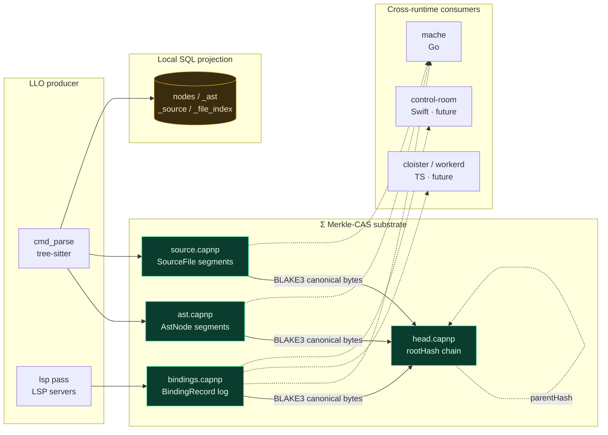
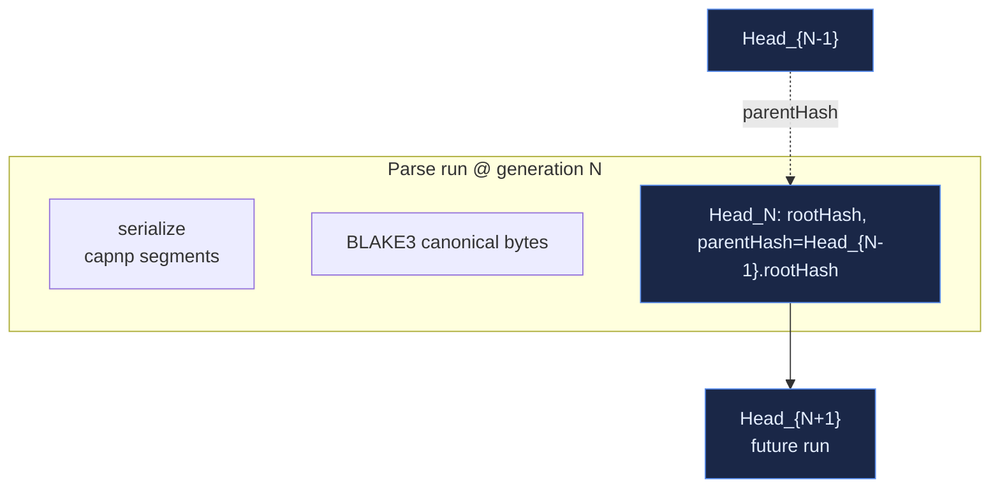

# ley-line-open

Open-source data plane primitives for agentic systems. Extracted from [ley-line](https://github.com/agentic-research/ley-line).

**New here?** [`GETTING-STARTED.md`](GETTING-STARTED.md) covers the user paths — mache auto-spawns leyline, so most users never run `leyline parse` themselves. Direct-use + working-on-LLO sections behind clear headers. Skip the rest of this README on first read.

## Architecture



**The substrate is the bytes**, not the SQL tables. Producers emit canonical-encoded Cap'n Proto messages into segment files (`*.capnp`); the Σ root is `BLAKE3(canonical(segments))` chained through `head.capnp`. Local SQL tables (`nodes`, `_ast`, `_source`, `_file_index`) are *projections* — fast indexes derived from the substrate, not the contract.

This is enforced — see [`docs/adr/0014-capnp-as-protocol.md`](docs/adr/0014-capnp-as-protocol.md). A `cargo test --test fileid_allowlist` gate locks every schema's `@0x...` fileId; a `cargo test --test cross_runtime_fixtures` gate asserts canonical-byte stability against committed fixtures.

## Crates

### Tier 1: Infrastructure (`ll-core/`)

| Crate | Purpose |
|-------|---------|
| `leyline-core` | Arena header (`repr(C)`, bytemuck), Controller (mmap'd control block, `current_root: [u8; 32]`) |
| `leyline-schema` | Shared `nodes` table DDL — local SQL contract (a *projection* of the substrate) |
| `leyline-public-schema` | Protobuf definition of nodes schema (cross-language SQL contract) |
| `leyline-schema-capnp` | **Cap'n Proto schemas** (`AstNode`, `SourceFile`, `BindingRecord`, `Head`, `Position`, `Range`, `Hash`) — the typed cross-runtime substrate contract per ADR-0014 |

### Tier 2: Projection Engine (`ll-open/`)

| Crate | Purpose |
|-------|---------|
| `leyline-fs` | SqliteGraph (zero-copy `sqlite3_deserialize`), Graph trait, reader pool, NFS/FUSE mount (feature-gated), C FFI bridge |
| `leyline-ts` | Tree-sitter AST projection + bidirectional splice |
| `leyline-lsp` | LSP client — spawns language servers, projects symbols + diagnostics into nodes; emits `BindingRecord` capnp event log |
| `leyline-hdc` | Hyperdimensional computing — D=8192 hypervectors via bundle composition + seeded leaves; popcount-Hamming distance; `HvCell` sheaf-stalks for `leyline-sheaf` (ADR-0024, ADR-0025) |
| `leyline-sheaf` | Čech cohomology engine — cochain complex (δ⁰, δ¹), sheaf cache with H⁰-based invalidation, restriction-weight learning |
| `leyline-cli-lib` | Daemon: living SQLite db + arena flip + Σ root advance + MCP/UDS surfaces |
| `leyline-cli` | `leyline` binary — `parse`, `lsp`, `daemon`, `serve`, `inspect` subcommands |

## Σ substrate

The Σ Merkle-CAS substrate is the unifying primitive — see [`docs/decades/2026-merkle-cas-substrate.md`](docs/decades/2026-merkle-cas-substrate.md). One-line definition:

> Σ = (𝓥, 𝓒, ρ, σ, R, S) is a content-addressed, **Merkle-rooted with BLAKE3**, CAS-advanced state substrate. The arena protocol is a degenerate case (sequence-named instead of hash-named). BLAKE3 is locked (post-red-team 2026-05-05).



Each parse run produces a fresh capnp segment, hashes it with BLAKE3 over **canonical bytes** (segment-table prefix stripped per the canonical-encoding spec), and chains a new `Head` whose `parentHash` points at the previous run. The chain is the file-backed analogue of `Controller::current_root` (T2.1) for the daemon path.

**What canonical encoding buys us** (ADR-0014 §1): adding a field at the next ordinal `@N` with default value does not change the canonical bytes for instances that don't set it. So additive schema changes do not advance Σ root for unchanged data — the substrate is byte-stable across schema evolution. Backed by Cap'n Proto's published canonical-encoding spec + the same precedent IPLD/DAG-CBOR and ATproto/DRISL follow.

## Cross-runtime contract

`leyline-schema-capnp` holds the canonical schemas. Other runtimes generate bindings from the same `.capnp` files:

| Runtime | Generator | Uses |
|---------|-----------|------|
| Rust (LLO) | `capnpc 0.20.0` (exact) | producer + local consumer |
| Go ([mache](https://github.com/agentic-research/mache)) | `capnpc-go` (exact tag) | reads `*.bindings.capnp` directly; no SQL JOIN |
| TypeScript (cloister/workerd) | future | edge gateway |
| Swift (control-room) | future | mobile client |

Toolchain triplet (compiler / generators / runtimes) exact-pinned per ADR-0014 §3. Cross-runtime byte-equality enforced by `tests/fixtures/*.bin` consumed by both Rust and Go CI.

See [`rs/ll-core/schema-capnp/README.md`](rs/ll-core/schema-capnp/README.md) for the file-format conventions and producer/consumer reader patterns.

## Build

```bash
cd rs
cargo build
cargo test
```

Or via Taskfile (preferred — wraps pkg-config for macFUSE-less hosts via the vendored `rs/pkgconfig/fuse.pc`):

```bash
task ci      # check + clippy + test (workspace 285+ tests)
```

### Install

Three install paths, matching the three feature-graph shapes on `leyline-cli`:

| Command | Features | When to use |
|---------|----------|-------------|
| `task install` | `lsp` + `validate` + `hdc` (default) | Structural-analysis core only. Portable, no system deps. Small binary. |
| **`task install:full`** | `--features all` = adds `vec` (fastembed) + `text-search` (WitchcraftEngine). NO mount | **Recommended for downstream consumers** (mache / cloister / notme / rosary). Portable — no libfuse-t/libfuse runtime dep. |
| `task install:full+mount` | `--features full` = adds `mount` (FUSE/NFS backend) | Only if you're going to mount an arena as a filesystem. **Requires libfuse-t (macOS) or libfuse (Linux) at runtime** or the binary won't launch. |

All three codesign on macOS (ad-hoc + entitlements) and drop the binary at `~/.local/bin/leyline`.

### Prereqs

**Build-time (all install paths):**
- `brew install capnp` (macOS) / `apt-get install capnproto libcapnp-dev` (Linux) — required for `build.rs` codegen; pinned to ≥1.3.0.

**Runtime (only for `install:full+mount`):**
- macOS: `brew install fuse-t` (no kernel extension needed).
- Linux: `apt-get install libfuse3-dev`.

`install` and `install:full` have NO runtime system-dep prereq.

**Optional acceleration:**
- `brew install sccache` (or `cargo install sccache`) — Taskfile auto-detects and sets `RUSTC_WRAPPER` for cross-invocation caching of byte-stable rustc work. No config needed.

## Building the image

A distroless OCI image (`ley-line-open:0.9.0`, ~20 MB) is built via [`krust`](https://github.com/imjasonh/krust) (cargo-zigbuild → static musl binary) + a one-line `docker build` that COPYs the binary onto `cgr.dev/chainguard/static`. See `image.Dockerfile` and `Taskfile.yml`. The image's default CMD is `daemon --mcp-port 8384 --mcp-bind 0.0.0.0` headless — no FUSE/NFS, just the MCP HTTP transport on `:8384` inside the container (consumed by cloister via `LLO_MCP_URL`, default `http://localhost:8384/mcp`).

```bash
brew install zig                   # cargo-zigbuild backend
cargo install cargo-zigbuild krust # one-time
task image                         # → ley-line-open:0.9.0 in local docker
task image:smoke                   # build + start daemon + curl tools/list
```

`--mcp-bind 0.0.0.0` is baked into the image's default CMD because docker port-forwarding can't reach a 127.0.0.1 (loopback-only) listener inside the container. The daemon binary still defaults to `127.0.0.1` for non-container use; only the image overrides.

Cross-arch: `task image PLATFORM=linux/amd64` builds an amd64 image instead. The Taskfile derives the matching musl target triple and passes it to docker via `--build-arg BIN_PATH=…`.

The apko/melange path was evaluated and abandoned on Apple Silicon (Docker Desktop's virtiofs stalls melange's workspace bind-mount; apko's multi-arch list fails when only the host arch APK exists). See bead `ley-line-open-2b255c` for the post-mortem.

## C FFI

`leyline-fs` builds as a staticlib (`libleyline_fs.a`) with a C header (`include/leyline_fs.h`):

```bash
cd rs
cargo build -p leyline-fs --lib
# Header: rs/ll-open/fs/include/leyline_fs.h
# Library: rs/target/debug/libleyline_fs.a
```

## Go bindings

Generated Go bindings for every public capnp schema ship as a separate Go module under [`clients/go/leyline-schema/`](clients/go/leyline-schema/) (multi-module monorepo, kubernetes/api / stripe-go pattern). Downstream Go consumers (mache first) `go get` it directly — no forking the `.capnp` files:

```go
import "github.com/agentic-research/ley-line-open/clients/go/leyline-schema/binding"
```

One sub-package per schema (`ast`, `binding`, `common`, `daemon`, `head`, `source`). Regen via `clients/go/leyline-schema/regen.sh`; CI gates on `git diff --exit-code` plus `go test ./...` decoding the same `tests/fixtures/*.bin` the Rust suite asserts byte-equality against.

Latest tag: [`clients/go/leyline-schema/v0.2.3`](https://github.com/agentic-research/ley-line-open/releases/tag/clients%2Fgo%2Fleyline-schema%2Fv0.2.3) — see [CHANGELOG.md](CHANGELOG.md) for what each `0.2.x` carries.

## Daemon protocol

`leyline-cli-lib` exposes the daemon over two transports — line-delimited JSON on a Unix-domain socket and JSON-RPC over MCP HTTP — sharing a single dispatch entry (`ops::handle_base_op` / `is_known_base_op`) covering 23 base ops plus `vec_search` under the `vec` Cargo feature: lifecycle (`status`, `flush`, `load`, `snapshot`, `reparse`, `enrich`), navigation (`list_roots`, `list_children`, `get_node`, `read_content`), graph queries (`find_callers`, `find_callees`, `find_defs`, `get_refs_map`, `get_defs_map`), introspection (`get_schema`, `get_db_path`), LSP (`lsp_hover`, `lsp_defs`, `lsp_refs`, `lsp_symbols`, `lsp_diagnostics`), bulk SQL (`query`), and embedding search (`vec_search`, feature-gated).

Most base-op responses are typed against `daemon.capnp` via [`rs/ll-open/cli-lib/src/daemon/wire.rs`](rs/ll-open/cli-lib/src/daemon/wire.rs) — the 17 covered today are the lifecycle, navigation, graph-query, and introspection ops listed above (`list_roots` shares `ListChildrenResponse`). Three groups stay outside the typed mirror by design:

- The 5 LSP ops (`lsp_hover`, `lsp_defs`, `lsp_refs`, `lsp_symbols`, `lsp_diagnostics`) emit ad-hoc JSON via a shared `lsp_rows_response` builder; their row shape is open-ended per LSP method, so a typed mirror would add ceremony without buying drift detection beyond what the fixture gate already provides.
- `vec_search` (feature-gated) returns ad-hoc JSON for the same reason — search-result rows are embedder-specific.
- `query` is the deliberate untyped escape hatch — its `rows` shape is column-keyed maps rather than the schema's positional `List(Text)` (tracked as a follow-up; the wire-shape change can't be reconciled additively).

For the typed ops, `BaseRequest` is a serde tagged enum (`#[serde(tag = "op", rename_all = "snake_case")]`) so unknown ops, malformed args, and missing required fields surface as structured errors rather than silent miss-and-coerce. The JSON encoding is the carrier today; the typed contract is the schema. See ADR-0014's *Out of scope (future ADRs) → Live RPC* section for the framing.

Cross-runtime parity is gated by `rs/ll-open/cli-lib/tests/fixtures/daemon-protocol.json`: a Rust integration test asserts every handler emits the required keys, and `clients/go/leyline-schema/daemon/daemon_protocol_test.go` decodes each fixture response into the matching typed Go struct under `json.DisallowUnknownFields` + explicit EOF (so unknown fields and trailing content also fail). Together the gates catch schema↔wire drift in CI; the typed enum + handler signatures catch most of it at compile time too, but wire.rs is a hand-written mirror so the fixture gate is the load-bearing guarantee.

## Schema contracts

Two layers of schema, intentionally distinct:

### 1. The substrate contract (`*.capnp` files)

The typed cross-runtime contract per ADR-0014. Lives in `rs/ll-core/schema-capnp/schemas/`:

| File | Schemas |
|------|---------|
| `common.capnp` | `Position`, `Range`, `Hash` (BLAKE3-32), `NodeRef` |
| `binding.capnp` | `BindingRecord` (target, refToken, construct/refSiteNodeId, refUri, range, parseGen, qualifier) |
| `ast.capnp` | `AstNode` (nodeId, sourceId, nodeKind, range) |
| `source.capnp` | `SourceFile` (id, language, canonicalPath, contentHash, mtime, size) |
| `head.capnp` | `Head` (rootHash, parentHash, generation, segmentBytes) |

Append-only-additive evolution. Never rename, never repurpose, never reuse ordinals. CI gate on `(filename, fileId)` allowlist. See [`docs/adr/0014-capnp-as-protocol.md`](docs/adr/0014-capnp-as-protocol.md).

### 2. The local SQL projection (`nodes` table)

Lives in `leyline-schema`. *Local query optimization*, not the contract. mache and other consumers may project capnp segments into SQL views of their own shape — the SQL columns are not the cross-process surface.

```sql
CREATE TABLE IF NOT EXISTS nodes (
    id TEXT PRIMARY KEY,
    parent_id TEXT,
    name TEXT NOT NULL,
    kind INTEGER NOT NULL,   -- 0=file, 1=dir
    size INTEGER DEFAULT 0,
    mtime INTEGER NOT NULL,
    record_id TEXT,          -- optional: FK into results table (mache lazy loading)
    record JSON,
    source_file TEXT         -- optional: originating source file (mache file tracking)
);
```

Per-layer schema partitioning lives in [`docs/TABLE_CONTRACT.md`](docs/TABLE_CONTRACT.md).

## References

- **ADR-0014 — Cap'n Proto as the producer/consumer protocol**: [`docs/adr/0014-capnp-as-protocol.md`](docs/adr/0014-capnp-as-protocol.md)
- **Σ Merkle-CAS substrate decade**: [`docs/decades/2026-merkle-cas-substrate.md`](docs/decades/2026-merkle-cas-substrate.md)
- **T8 thread design analysis**: [`docs/decades/T8/adr-0014-design-analysis.md`](docs/decades/T8/adr-0014-design-analysis.md)
- **T8 thread RTFM dossier**: [`docs/decades/T8/capnp-rtfm-findings.md`](docs/decades/T8/capnp-rtfm-findings.md)
- **Cross-runtime fixture conventions**: [`rs/ll-core/schema-capnp/README.md`](rs/ll-core/schema-capnp/README.md)

## License

AGPL-3.0 — see [LICENSE](LICENSE).
