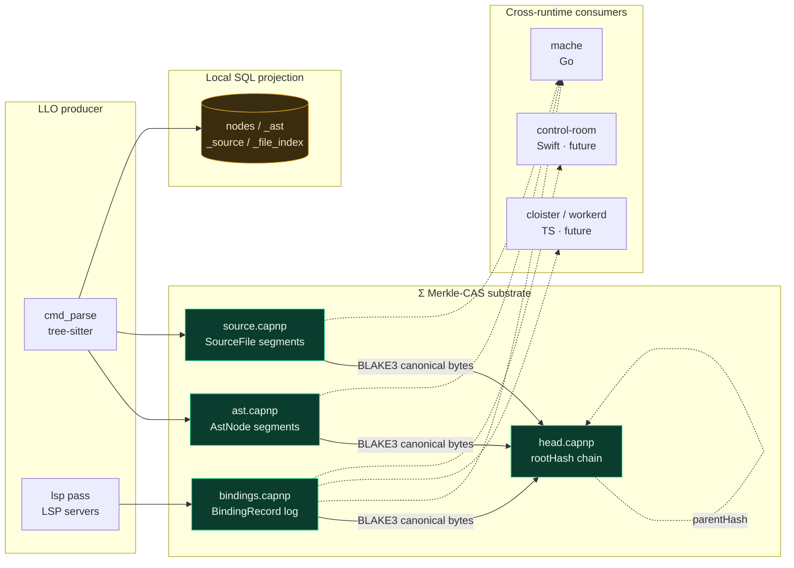

# ley-line-open

Open-source data plane primitives for agentic systems. Extracted from [ley-line](https://github.com/agentic-research/ley-line).

## Architecture



**The substrate is the bytes**, not the SQL tables. Producers emit canonical-encoded Cap'n Proto messages into segment files (`*.capnp`); the Σ root is `BLAKE3(canonical(segments))` chained through `head.capnp`. Local SQL tables (`nodes`, `_ast`, `_source`, `_file_index`) are *projections* — fast indexes derived from the substrate, not the contract.

This is enforced — see [`docs/adr/0014-capnp-as-protocol.md`](docs/adr/0014-capnp-as-protocol.md). A `cargo test --test fileid_allowlist` gate locks every schema's `@0x...` fileId; a `cargo test --test cross_runtime_fixtures` gate asserts canonical-byte stability against committed fixtures.

## Crates

### Tier 1: Infrastructure (`ll-core/`)

| Crate | Purpose |
|-------|---------|
| `leyline-core` | Arena header (`repr(C)`, bytemuck), Controller (mmap'd control block, `current_root: [u8; 32]`) |
| `leyline-schema` | Shared `nodes` table DDL — local SQL contract (a *projection* of the substrate) |
| `leyline-public-schema` | Protobuf definition of nodes schema (cross-language SQL contract) |
| `leyline-schema-capnp` | **Cap'n Proto schemas** (`AstNode`, `SourceFile`, `BindingRecord`, `Head`, `Position`, `Range`, `Hash`) — the typed cross-runtime substrate contract per ADR-0014 |

### Tier 2: Projection Engine (`ll-open/`)

| Crate | Purpose |
|-------|---------|
| `leyline-fs` | SqliteGraph (zero-copy `sqlite3_deserialize`), Graph trait, reader pool, NFS/FUSE mount (feature-gated), C FFI bridge |
| `leyline-ts` | Tree-sitter AST projection + bidirectional splice |
| `leyline-lsp` | LSP client — spawns language servers, projects symbols + diagnostics into nodes; emits `BindingRecord` capnp event log |
| `leyline-hdc` | Hyperdimensional computing — `HvCell` sheaf-stalks-over-hypervectors (Heyting algebra; bit-level Hamming agreement) |
| `leyline-cli-lib` | Daemon: living SQLite db + arena flip + Σ root advance + MCP/UDS surfaces |
| `leyline-cli` | `leyline` binary — `parse`, `lsp`, `daemon`, `serve`, `inspect` subcommands |

## Σ substrate

The Σ Merkle-CAS substrate is the unifying primitive — see [`docs/decades/2026-merkle-cas-substrate.md`](docs/decades/2026-merkle-cas-substrate.md). One-line definition:

> Σ = (𝓥, 𝓒, ρ, σ, R, S) is a content-addressed, **Merkle-rooted with BLAKE3**, CAS-advanced state substrate. The arena protocol is a degenerate case (sequence-named instead of hash-named). BLAKE3 is locked (post-red-team 2026-05-05).

```mermaid
flowchart TB
  subgraph parse_run[Parse run @ generation N]
    p1[serialize<br/>capnp segments]
    p2[BLAKE3 canonical bytes]
    p3[Head_N: rootHash, parentHash=Head_{N-1}.rootHash]
  end
  prev[Head_{N-1}] -. parentHash .-> p3
  p3 --> next[Head_{N+1}<br/>future run]
  classDef chain fill:#1a2747,stroke:#5a8eed,color:#e3edff;
  class prev,p3,next chain;
```

Each parse run produces a fresh capnp segment, hashes it with BLAKE3 over **canonical bytes** (segment-table prefix stripped per the canonical-encoding spec), and chains a new `Head` whose `parentHash` points at the previous run. The chain is the file-backed analogue of `Controller::current_root` (T2.1) for the daemon path.

**What canonical encoding buys us** (ADR-0014 §1): adding a field at the next ordinal `@N` with default value does not change the canonical bytes for instances that don't set it. So additive schema changes do not advance Σ root for unchanged data — the substrate is byte-stable across schema evolution. Backed by Cap'n Proto's published canonical-encoding spec + the same precedent IPLD/DAG-CBOR and ATproto/DRISL follow.

## Cross-runtime contract

`leyline-schema-capnp` holds the canonical schemas. Other runtimes generate bindings from the same `.capnp` files:

| Runtime | Generator | Uses |
|---------|-----------|------|
| Rust (LLO) | `capnpc 0.20.0` (exact) | producer + local consumer |
| Go ([mache](https://github.com/agentic-research/mache)) | `capnpc-go` (exact tag) | reads `*.bindings.capnp` directly; no SQL JOIN |
| TypeScript (cloister/workerd) | future | edge gateway |
| Swift (control-room) | future | mobile client |

Toolchain triplet (compiler / generators / runtimes) exact-pinned per ADR-0014 §3. Cross-runtime byte-equality enforced by `tests/fixtures/*.bin` consumed by both Rust and Go CI.

See [`rs/ll-core/schema-capnp/README.md`](rs/ll-core/schema-capnp/README.md) for the file-format conventions and producer/consumer reader patterns.

## Build

```bash
cd rs
cargo build
cargo test
```

Or via Taskfile (preferred — wraps pkg-config for macFUSE-less hosts via the vendored `rs/pkgconfig/fuse.pc`):

```bash
task ci      # check + clippy + test (workspace 285+ tests)
task install # build release + codesign with entitlements + install to ~/.local/bin
```

macOS prereq: `brew install fuse-t` (no kernel extension needed).
Linux prereq: `apt-get install libfuse3-dev`.
Capnp prereq (both): `brew install capnp` / `apt-get install capnproto` (required for build.rs codegen; pinned to ≥1.3.0).

## C FFI

`leyline-fs` builds as a staticlib (`libleyline_fs.a`) with a C header (`include/leyline_fs.h`):

```bash
cd rs
cargo build -p leyline-fs --lib
# Header: rs/ll-open/fs/include/leyline_fs.h
# Library: rs/target/debug/libleyline_fs.a
```

## Schema contracts

Two layers of schema, intentionally distinct:

### 1. The substrate contract (`*.capnp` files)

The typed cross-runtime contract per ADR-0014. Lives in `rs/ll-core/schema-capnp/schemas/`:

| File | Schemas |
|------|---------|
| `common.capnp` | `Position`, `Range`, `Hash` (BLAKE3-32), `NodeRef` |
| `binding.capnp` | `BindingRecord` (target, refToken, construct/refSiteNodeId, refUri, range, parseGen, qualifier) |
| `ast.capnp` | `AstNode` (nodeId, sourceId, nodeKind, range) |
| `source.capnp` | `SourceFile` (id, language, canonicalPath, contentHash, mtime, size) |
| `head.capnp` | `Head` (rootHash, parentHash, generation, segmentBytes) |

Append-only-additive evolution. Never rename, never repurpose, never reuse ordinals. CI gate on `(filename, fileId)` allowlist. See [`docs/adr/0014-capnp-as-protocol.md`](docs/adr/0014-capnp-as-protocol.md).

### 2. The local SQL projection (`nodes` table)

Lives in `leyline-schema`. *Local query optimization*, not the contract. mache and other consumers may project capnp segments into SQL views of their own shape — the SQL columns are not the cross-process surface.

```sql
CREATE TABLE IF NOT EXISTS nodes (
    id TEXT PRIMARY KEY,
    parent_id TEXT,
    name TEXT NOT NULL,
    kind INTEGER NOT NULL,   -- 0=file, 1=dir
    size INTEGER DEFAULT 0,
    mtime INTEGER NOT NULL,
    record_id TEXT,          -- optional: FK into results table (mache lazy loading)
    record JSON,
    source_file TEXT         -- optional: originating source file (mache file tracking)
);
```

Per-layer schema partitioning lives in [`docs/TABLE_CONTRACT.md`](docs/TABLE_CONTRACT.md).

## References

- **ADR-0014 — Cap'n Proto as the producer/consumer protocol**: [`docs/adr/0014-capnp-as-protocol.md`](docs/adr/0014-capnp-as-protocol.md)
- **Σ Merkle-CAS substrate decade**: [`docs/decades/2026-merkle-cas-substrate.md`](docs/decades/2026-merkle-cas-substrate.md)
- **T8 thread design analysis**: [`docs/decades/T8/adr-0014-design-analysis.md`](docs/decades/T8/adr-0014-design-analysis.md)
- **T8 thread RTFM dossier**: [`docs/decades/T8/capnp-rtfm-findings.md`](docs/decades/T8/capnp-rtfm-findings.md)
- **Cross-runtime fixture conventions**: [`rs/ll-core/schema-capnp/README.md`](rs/ll-core/schema-capnp/README.md)

## License

AGPL-3.0 — see [LICENSE](LICENSE).
