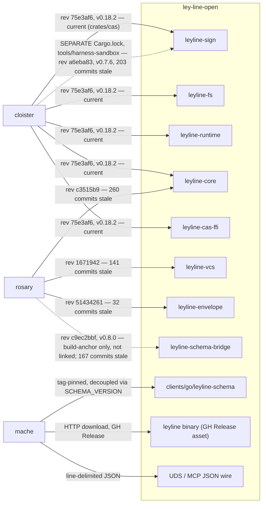

# Architecture — ley-line-open

Canonical architecture overview for ley-line-open (LLO). Companion to the [root README](../README.md) (which frames the project) and the [rs/ workspace README](../rs/README.md) (which maps the crate layout). This doc records the **vocabulary**, the **code layers + their contracts**, the **authority model** (which identity domain is authoritative for what), the **runtime model and surfaces**, and the **load-bearing ADRs**.

---

## Status

| Field | Value |
|---|---|
| LLO version | v0.18.2 |
| Last verified | 2026-07-27 |
| Authority model | [ADR-0032](adr/0032-declared-decompositions.md) §D4 — see [Authority model](#authority-model) |
| Source of truth files | `rs/ll-core/`, `rs/ll-open/`, `rs/ll-open/cli-lib/src/daemon/`, `docs/adr/*.md`, `docs/decades/*.md`, `CHANGELOG.md` |

This file is canonical for the architectural shape. Per-crate detail lives in each crate's `README.md`. Per-decision detail lives in `docs/adr/`. Per-table contract lives in [`TABLE_CONTRACT.md`](TABLE_CONTRACT.md). Per-decade design lives in [`docs/decades/`](decades/).

---

## Vocabulary

This section is the single definition site for the terms used across
[README.md](../README.md), this file, and [`TABLE_CONTRACT.md`](TABLE_CONTRACT.md).
It follows [ADR-0032](adr/0032-declared-decompositions.md) §D1/§D4. Where those
docs need one of these terms, they use it as defined here and do not redefine it.

**"Substrate" means exactly one thing: the Σ content-addressing primitive** —
`leyline-core::substrate`, whose `Hash` is BLAKE3-locked
(`rs/ll-core/core/src/substrate.rs:28-42`). It is not a name for the SQL tables,
for the arena snapshot loop, for the CDC chunk cache, or for the dataflow
analysis tables. Two pre-existing proper nouns keep the word for historical
reasons and denote none of the above: the `analysis-substrate` decade and
ADR-0024's title.

Per ADR-0032 §D1 there are three declared structures, answering three different
questions over the same bytes. They are deliberately not merged; §D1 records that
impossibility results (A)–(D) forbid it.

| Term | What it names | Status |
|---|---|---|
| **SQLite arena snapshot root** (`Controller.current_root`) | integrity of one serialized byte image | shipped — `rs/ll-open/cli-lib/src/cmd_daemon.rs:1263-1266` |
| **Cap'n Proto segment root** (`Head.rootHash`) | which parse run produced these segments | shipped — `rs/ll-open/cli-lib/src/cmd_parse.rs:1783-1790` |
| **blob hash** | one CDC/CAS payload | shipped — `rs/ll-core/core/src/substrate.rs:167-179` |
| **SQL projection ABI** | the queryable tables, columns, and indexes | shipped — a contract, **not** an identity domain; see §D4 below |
| `manifestRoot` | which regions changed; transport units | **proposed only.** ADR-0032 §D3; no implementation in `rs/` |
| `logicalRoot` | derived-view validity | **proposed only.** ADR-0032 §D3; no implementation in `rs/` |

ADR-0032 is Status: Proposed. The first four rows describe shipped code; the last
two are named here so that nobody invents a competing term for them, and must not
be described anywhere as existing behaviour.

---

## Code layers and runtime surfaces

LLO has **two code-dependency layers**. The consumer-facing transports are not a
third layer — they are runtime surfaces served from a crate inside the upper
layer, and are described separately below.

```
┌──────────────────────────────────────────────────────────────────┐
│  PROJECTION ENGINE  (rs/ll-open/)                                │
│  parse · LSP ingest · enrichment passes (HDC, vec, sheaf)        │
│  CDC chunking · filesystem presentation (FUSE/NFS) · sign · vcs  │
│                                                                  │
│  `leyline-cli-lib` also hosts the runtime surfaces — the UDS     │
│  control socket and the MCP HTTP server. See below.              │
└──────────────────────────────────────────────────────────────────┘
                            ▲ depends on
┌──────────────────────────────────────────────────────────────────┐
│  INFRASTRUCTURE  (rs/ll-core/)                                   │
│  arena (mmap'd, double-buffered) · Σ BLAKE3 content-addressing   │
│  SQLite schema (nodes + sidecars) · capnp wire schemas           │
└──────────────────────────────────────────────────────────────────┘
```

### Layer 1: Infrastructure (`rs/ll-core/`)

Content-addressed storage and snapshot primitives used by the other crates.

| Crate | Purpose | Key types |
|---|---|---|
| `leyline-core` | Arena primitives. mmap'd files + control block + generation counter for hot-reload. `ContentAddressed` trait = the σ substrate entry point (BLAKE3-locked per Σ §3.4) | `ArenaHeader`, `Controller`, `ContentAddressed`, `Hash` |
| `leyline-schema` | Shared SQLite schema for the `nodes` table + indexes | `create_schema`, `insert_node` |
| `leyline-public-schema` | Capnp wire schema for the daemon UDS + MCP transport. Source of truth for every base op's request/response shape with `$Json.name` annotations for camel↔snake | `capnp/daemon.capnp` |
| `leyline-schema-capnp` | Capnp schemas for the Σ event log (`AstNode`, `SourceFile`, `BindingRecord`, `Head`, `AstNodeList`). Decade `ley-line-open-9d30ac` | Generated Rust bindings |
| `leyline-ffi-helpers` | Typed helpers for the C-boundary raw-pointer pattern used by every LLO `extern "C" fn`, so the SAFETY contract lives in one place | `c_input`, `c_output` |
| `leyline-schema-spec` | Vendor-neutral IDL crate. Ships per-capability specs (`credential-isolation/v1`, `confinement/v1`, `build-cache/v1`, `mcp-tool/v1`) with canonical test vectors + integrity/identity pins. Verified by `verify_vectors_sha256` (SHA-256 integrity) + `verify_confinement_digest` (BLAKE3-256 identity) + `capability_mapping_coverage` + `version_bump_on_vector_change` cargo tests | Non-code artifact — spec dirs + pin files |
| `leyline-mcp-descriptor` | MCP Registry `server.json` emitter — coverage validation + render, shared across ART producers (bead `ley-line-open-4ec276`) | `render`, `ServerMeta`, `ToolRef` |
| `leyline-mcp-protocol-schema` | MCP JSON-RPC method-name facts generated at build time from a digest-pinned schema; digest mismatch fails compilation, not a test (bead `ley-line-open-60f0d3`) | build-generated constants |

**Contract:** the Σ substrate is **BLAKE3-locked** (ADR-0032 §D5). Every content address is a BLAKE3 digest (`leyline-core::substrate::ContentAddressed for [u8]`, `rs/ll-core/core/src/substrate.rs:129-147`).

SHA-256 is used in three places, none of which is a content address:

| Site | Use | Verified at |
|---|---|---|
| OCI ecosystem boundary | registry digest format | ecosystem-imposed |
| `VECTORS.sha256` pins under `schema-spec/*/v*/` | test-vector file integrity — a distinct concern from the BLAKE3-256 identity digests pinned in `CONFINEMENT_DIGESTS.blake3` (bead `ley-line-open-193170`) | `rs/ll-core/schema-spec/tests/verify_vectors_sha256.rs:21` |
| `canonical_kid` | Ed25519 key fingerprint = `lowercasehex(SHA-256(canonical SPKI DER)[:16])` per signet ADR-012 | `rs/ll-open/sign/src/kid.rs:55-58` |

A key fingerprint is not a content address, so `canonical_kid` does not weaken the BLAKE3 lock. Whether it should nonetheless move to BLAKE3 for cross-repo consistency is open and is **not** settled by ADR-0032.

### Layer 2: Projection engine (`rs/ll-open/`)

Where source becomes structure. Parses, enriches, signs, presents.

| Crate | Purpose | Key entry points |
|---|---|---|
| `leyline-ts` | Tree-sitter AST projection + bidirectional splice | `parse`, `splice` |
| `leyline-lsp` | LSP client for ingesting language-server analysis into SQLite | `LspClient`, `document_symbols`, `hover` |
| `leyline-hdc` | Hyperdimensional computing — D=8192 hypervectors via bundle composition + seeded leaves; popcount-Hamming distance (ADR-0024) | `EncoderNode`, `encode_fresh`, `Hypervector` |
| `leyline-sheaf` | Čech-cohomology engine; structural cache + δ⁰-driven invalidation (ADR-0020). **3 sub-components, 3 risk profiles** — see [`sheaf/README.md`](../rs/ll-open/sheaf/README.md) | `CellComplex`, `SheafCache` |
| `leyline-cdc` | Content-defined chunking (GearHash, xet-compatible params), 8–128 KiB bounds (`cdc/src/lib.rs:29-40`). Produces blob hashes; produces **no** root | `chunk_into`, `read_range` |
| `leyline-fs` | Filesystem presentation — mounts arena as FUSE or NFS; optional CDC-derived chunk manifests for bounded range reads. **Externally pinned** — cloister depends on this crate directly | `SqliteGraph`, `SqliteGraphAdapter`, `activate_chunked_content` |
| `leyline-envelope` | DSSE envelope + in-toto Statement v1 attestation over `leyline-sign`'s root signer; byte-compatible hoist of rosary's `dsse.rs` | `Envelope`, `Statement`, `sign_payload`, `verify_payload` |
| `leyline-runtime` | Capability-resolved execution lifecycle + isolation backends (`execution/v1`) — authorization, native/libkrun backends, confinement (ADR-0035). **Externally pinned** — cloister's `host-runtime` depends on this crate, gated behind its own `llo-execution` feature | `ExecutionService`, `AuthorizedExecution`, `Backend` |
| `leyline-schema-bridge` | capnp compiler plugin family — capnp schemas → zod TS / Go / JSON Schema codegen; unmapped constructs are hard errors. Also a rosary build-anchor | `capnpc-schema-bridge-*` binaries |
| `leyline-vcs` | jj sidecar — automatic versioning of arena snapshots. **External-facing**: no in-workspace consumer; git-rev pinned directly by rosary (see Cross-runtime consumers below) | `VersionedGraph`, `.leyline/` virtual dir |
| `leyline-sign` | Ed25519 `RootSigner` that signs the at-rest Σ `Head` (S1) + `verify_head` verify-on-load (S2) + the canonical key id `kid = lowercasehex(SHA-256(SPKI)[:16])` (S3, signet ADR-012); plus CMS/gpgsm verify primitives for jj commit signing (interactive host signing stays cloister-side per ADR-0019). **Externally pinned twice** by cloister, at two different revs — see Cross-runtime consumers below | `Ed25519RootSigner`, `verify_head`, `canonical_kid`, Certificate, Signature |
| `leyline-cas-ffi` | Wasm32-callable FFI for BLAKE3-substrate hash. **External-facing**: no in-workspace consumer; consumed by cloister via workerd's cdylib loader | `leyline_hash_bytes` |
| `leyline-text-search` | Unstructured-text semantic search backend abstraction. `NullEngine` default; `WitchcraftEngine` (XTR-WARP) behind feature flag | `TextSearchEngine` trait |
| `leyline-chat-embed` | CLI binary: semantic search over Claude Code chat databases (mache's `claude-chats` ingest) via fastembed/MiniLM | `chat-embed` binary |
| `leyline-cli-lib` | The daemon. Owns the living db + UDS control socket + MCP HTTP transport; hosts all enrichment passes | `cmd_daemon`, `daemon::ops` |
| `leyline-cli` | The `leyline` binary. Thin wrapper around `leyline-cli-lib` | `parse`, `daemon`, `serve`, `inspect` |

**Contract:** The `nodes` + `_ast` + `_source` + `node_content` tables form the
core **SQL projection ABI**; enrichment passes write derived sidecars (`_lsp*`,
`_hdc*`, `_cfg`/`_cfg_edge`, etc.). Re-indexing a sidecar does not redefine the
Cap'n Proto segment root or the SQLite arena snapshot root.

Per ADR-0032 §D4 the SQL projection ABI is **a contract, not an identity domain**:
it is authoritative for which tables, columns, and indexes a consumer may rely on,
it has no root, and it must never be given one. `nodes.record` is the
cross-runtime ABI — mache reads that column directly out of the projection, with
no cgo (`mache/internal/ingest/ast_walker_nodes.go:23`).

**In-flight (analysis-substrate decade, `docs/decades/analysis-substrate.md`):** The `_cfg` / `_dfg` / `_taint` fact tables — three projections of one differential-dataflow computation over the existing `_ast` / `node_content` / `node_defs` / `node_refs` EDB, driven by `daemon.sheaf.invalidate` as the epoch tracker. v0.7.2 shipped T1's schema + κ CFG-kind vocabulary + reflow-invariant CFG builder + F1_cfg_reflow_stable gate. T1.b3-followup (bead `a0fadd`) wires `_cfg` population into `cmd_parse`; T2 / T3 / T4 still open. `docs/decades/analysis-substrate.md` §4.1 names the sub-file staging layer as a decade-level open question to resolve before T3.b3 (bead `c25128`).

### Runtime surfaces (served from `leyline-cli-lib`)

Two wire transports, one tool surface. These are **not a third code layer**: both
listeners are modules of the `leyline-cli-lib` crate, which is itself in Layer 2
— the UDS listener at `rs/ll-open/cli-lib/src/daemon/socket.rs:38-43` (the only
`UnixListener` in the workspace) and the MCP HTTP server at
`rs/ll-open/cli-lib/src/daemon/mcp.rs:688-722`. What follows is the runtime
topology a consumer sees, not a dependency edge.

| Transport | Path | Used by |
|---|---|---|
| **UDS** | `~/.mache/<arena>.ctrl.sock` (default) — local-process IPC | mache (Go), other same-machine consumers |
| **MCP HTTP** | `:8384` default (`--mcp-port`) — JSON-RPC tool surface for agents (token-gated per ADR-0022) | Claude Code (MCP plugin), cloister (proxy via Cloudflare Access) |

Both transports dispatch to the same op registry — see `rs/ll-open/cli-lib/src/daemon/` for the dispatcher. Adding an op = capnp variant + Rust arm + entry in `is_known_base_op`. The op surface is ~23 base ops grouped by purpose (lifecycle, navigation, graph queries, introspection, LSP, bulk SQL, embedding search).

---

## Authority model

This is [ADR-0032](adr/0032-declared-decompositions.md) §D4 applied to the
shipped code. It is the arbiter when this doc, [README.md](../README.md), and
[`TABLE_CONTRACT.md`](TABLE_CONTRACT.md) appear to disagree.

Three identity domains are deliberately separate, plus one contract that is not
an identity domain at all:

| Domain | Authoritative for | May depend on | Must NOT claim | Verification boundary |
|---|---|---|---|---|
| **SQLite arena snapshot root** — `Controller.current_root` | the exact byte image of one snapshot | nothing | anything about logical content | BLAKE3 over the whole serialized buffer, checked before deserialization |
| **Cap'n Proto segment root** — `Head.rootHash` | that a given parse run produced these segments | the segment bytes it folds over | to name the same thing as `current_root` | canonical-encoding fixtures + tagged fold |
| **blob hash** | one CDC/CAS payload | the snapshot that contains it | to be a root for anything | `BlobStore::get` verify-on-read |
| **SQL projection ABI** | queryable tables, columns, and indexes | none of the above | **to be "the substrate"; to have a root** | schema + cross-runtime query fixtures |

This table maps §D4's columns onto the domains that actually exist in code, which
is not a one-to-one fit and should not be presented as one:

- §D4's **dedup** row is written against `manifestRoot`, which is not
  implemented. The shipped dedup-adjacent identity is the per-payload **blob
  hash**; the CDC manifest that organizes those payloads has no root.
- §D4's **logical** row is written against `logicalRoot`, which is not
  implemented; no row appears above for it.
- The **Cap'n Proto segment root** is shipped and load-bearing, but §D4's table
  does not assign it authority — it appears only as identity #2 in ADR-0032's
  Context table. Its row above is this document's reading, not a quotation, and
  is the one row a future ADR may need to revise.

Two consequences worth stating outright, because prose in this repo has broken
both before:

- **The SQL projection ABI has no root and must never be given one.** It is a
  contract about shape, not an identity over bytes. Adding a root to it would
  create one more identity nobody can derive.
- **`current_root` and `Head.rootHash` are not the same thing and neither
  derives from the other.** ADR-0032 Theorem 1 proves no such derivation exists
  for two folds over the same value; §D3 therefore binds roots by naming them
  together in one signed claim (co-attestation), not by computing one from the
  other.

`current_root` is a **flat** BLAKE3 digest of one serialized byte image
(`rs/ll-open/cli-lib/src/cmd_daemon.rs:1263-1266` → `rs/ll-core/core/src/substrate.rs:147`).
It has no partition structure of its own, and per ADR-0032 impossibility (A) it
cannot be reconstructed as a fold over CDC chunks — BLAKE3's internal tree is
over a fixed 1024-byte grid with a position-binding counter, so no
content-defined chunk hash is ever a node of it.

`Head.rootHash` **is** a tagged fold: `PartitionSpec::address` over per-segment
addresses under the `leyline/segment-root/v1` scheme
(`rs/ll-open/cli-lib/src/cmd_parse.rs:1783-1790`, `rs/ll-core/core/src/partition.rs:106-119`),
keyed with `blake3::Hasher::new_derive_key` so the scheme tag is folded into the
digest rather than riding alongside it (§D2). It is one level over three
segments, not a recursive Merkle tree.

The `analysis-substrate` decade's dataflow tables (`_cfg` / `_dfg` / `_taint`)
and the HDC similarity system are **derived analysis facilities**. Neither is an
identity domain, and the word "substrate" in the decade's name does not make
either one the Σ substrate.

### The snapshot loop

LLO's daemon runs a **living SQLite database in memory** with an **arena snapshot loop**:

1. **Parse phase**: `leyline-ts` walks tree-sitter ASTs into the in-memory db.
2. **Enrichment phase**: each registered pass (LSP → `_lsp*` tables; HDC → `_hdc*` tables; etc.) writes sidecar rows.
3. **Optional CDC activation**: `daemon --cdc` resumably builds private chunk
   manifests from authoritative readable `nodes.record` leaves before the
   first snapshot. Missing or stale manifests fall back to the authoritative
   record (`rs/ll-open/fs/src/chunked.rs:936-946`, freshness gate at `:789`);
   no schema-client or wire contract changes. Chunk reads verify σ before
   returning and fail closed on mismatch rather than silently re-reading
   `nodes.record` (`rs/ll-open/fs/src/chunked.rs:166-183`). The manifest is
   keyed by `(node_id, seq)` and **has no root** — see the authority model
   above. Long-lived writable projections run explicit `leyline cdc gc` off
   the hot path; one IMMEDIATE transaction deletes only chunk rows unreachable
   from every manifest and reports rows and bytes before, unreachable, deleted,
   and remaining.
4. **Snapshot**: serialize current db state → arena buffer → BLAKE3-hash → advance `current_root` on the controller's generation counter.
5. **Readers**: mmap the arena to validate the active serialized bytes, then
   `deserialize_read_exact` copies the verified slice into SQLite-owned memory;
   detect generation change → rebuild and hot-swap the reader. LLO is not
   currently zero-copy.

The arena is double-buffered: a writer flip advances the controller; readers see atomic transitions via the generation counter. Multiple readers share a lock-free pool (`SqliteGraphAdapter`), 2-8 readers auto-sized.

```
                  ┌─────────┐
                  │ writer  │
                  └────┬────┘
                       ▼ writes
        ┌──────────────────────────────┐
        │ in-memory living db (SQLite) │
        └──────────────┬───────────────┘
                       ▼ snapshot
        ┌────────────────────────────────┐
        │  arena (mmap'd, double-buffered)│
        │  ┌──────────────┬──────────────┐│
        │  │ buffer A     │ buffer B     ││
        │  └──────────────┴──────────────┘│
        │  controller: current_root, gen  │
        └─────┬──────────────┬────────────┘
              ▼              ▼
        ┌──────────┐    ┌──────────┐
        │ reader 1 │    │ reader N │  (SqliteGraph pool)
        └──────────┘    └──────────┘
```

---

## Cross-runtime consumers

LLO is consumed across language runtimes:

- **mache (Go)** — primary consumer. **No cgo**: pure-Go `modernc.org/sqlite`
  (`mache/go.mod:26`), `CGO_ENABLED=0` in its release build
  (`mache/.github/workflows/release.yml:69`). It consumes LLO by four distinct
  routes, which are worth separating because they hit different contracts:
  - **SQL projection ABI** — opens the `leyline parse` output db directly and
    SELECTs `nodes` joined to `_ast`, reading `nodes.record`
    (`mache/internal/ingest/ast_walker_nodes.go:23`).
  - **Daemon ops over UDS** — line-delimited JSON; the dominant path for live
    queries (`mache/internal/leyline/socket.go`).
  - **Cap'n Proto** — only the sibling `${db}.bindings.capnp` binding log,
    decoded with the pure-Go `binding` package
    (`mache/internal/lsp/binding_log.go:97,159-166`). It does **not** read
    `ast.capnp`, `source.capnp`, or `head.capnp`; those are marked "future" in
    mache itself (`mache/internal/lsp/binding_log.go:1-2`).
  - **Arena control block** — its own pure-Go mmap in `mache mount --control`,
    reading `current_root` (`mache/internal/control/control.go:24-25`).

  It reads no CDC table. It exposes its own MCP surface for code-intel tools.
- **cloister (Rust / TS / workerd)** — agent execution + network topology layer. Consumes `leyline-cas-ffi` via `cloister-cas.wasm` for substrate-aligned hashing. Calls LLO's MCP over HTTP through Cloudflare Access (per ADR-0022's Mode B). Also a **direct compiled-crate consumer** — see the pin table below.
- **rosary (Rust)** — agent orchestration + bead tracking. Direct compiled-crate consumer of `leyline-core` (CAS hashing — rosary dropped `blake3` as a direct dep so it cannot drift off the substrate lock), `leyline-vcs` (jj sidecar integration), and `leyline-envelope` (DSSE/in-toto signing hoisted out of rosary per `rosary-30ae8c`), plus a build-anchor dependency on `leyline-schema-bridge`.
- **Control-room (Swift, future)** — consumes the same FFI surface as cloister via the C ABI.
- **notme** — **not a dependency.** Its `server.json` hand-copies the JSON shape `leyline-mcp-descriptor` renders, with an explicit comment that the LLO version noted there is "a provenance note, not a pin." No build or runtime coupling.

Naming rule (cross-repo design beads `cloister-5e4402` / `ley-line-open-5e05e6`): **anything named `leyline-*` lives in LLO**. Cloister hosts `cloister-*` bridge crates that depend on LLO primitives — never forks or symlink-plus-extensions.

### Compiled-crate consumers — verified pin state (2026-08-14, against `main` = v0.18.2 / `75e3af6`)

Unlike mache (binary + wire-protocol only, no compiled-crate coupling), cloister and rosary link LLO crates directly via git-rev/tag pins in their own `Cargo.toml`. This is where version skew becomes a live risk, not a hypothetical one. Distances below are `git rev-list --count <pin>..main` at the stated date — re-measure before trusting them, since only the pinning repo can move a pin:



Three drift findings, all worth checking before assuming a pin is current:

- **cloister's main workspace is now exactly current.** `rs/crates/cas` and `rs/crates/host-runtime` (one shared `Cargo.lock`) are uniformly on rev `75e3af6` (v0.18.2) — the same commit `main` points at. The earlier code comment claiming a 3-way `leyline-core` version conflict there is stale; the lock file shows no duplicates.
- **cloister's `leyline-sign` pin is still split across two generations within the same repo, and the gap has widened.** `tools/harness-sandbox` is a **separate crate with its own `Cargo.lock`**, still pinned at rev `a6eba83` (v0.7.6, 2026-07-13) — now **203 commits** behind, against a main workspace sitting at HEAD — with a comment asserting it's "SAME rev as `rs/crates/cas`," which is no longer true. `harness-sandbox` uses this pin to verify the `confinementDigest` Interlace cert extension; whether the cert format is still compatible across that gap is unverified, and every LLO release widens it.
- **rosary pins three LLO crates at three different generations.** `leyline-core` at rev `c3515b9` (260 commits), `leyline-vcs` at rev `1671942` (141 commits), `leyline-envelope` at rev `51434261` (32 commits). The `leyline-vcs` pin is deliberate — it sits exactly at the commit that fixed a real incident (`ley-line-open-99a9fe` / PR #257 — `jj-lib`'s Git backend was silently compiled out, breaking every `jj git init` repo rosary dispatches against), and `workspace_root_pins_the_jj_git_backend` fails if a future repin drops the backend again. The `leyline-core` pin being the *oldest* of the three is the one to look at: rosary routes CAS hashing through `leyline-core`'s `ContentAddressed::hash` specifically so it cannot drift off the substrate lock, and a 260-commit-old substrate is a weaker version of that guarantee than the comment implies.

None of these is LLO's to fix directly — every pin lives in another repo's `Cargo.toml`. What LLO owes them is published crates instead of git revs, which is what `.github/workflows/publish-crates.yml` and bead `ley-line-open-c3e8c6` exist to deliver.

---

## Load-bearing ADRs

Architectural decisions that shape LLO today:

| ADR | Subject | Status |
|---|---|---|
| [ADR-0014](adr/0014-capnp-as-protocol.md) | Capnp as the wire protocol | Accepted |
| [ADR-0015](adr/0015-lazy-on-access-ingestion.md) | Lazy-on-access ingestion | Accepted |
| [ADR-0016](adr/0016-ai-native-query-surface.md) | AI-native query surface | Accepted |
| [ADR-0020](adr/0020-entity-observation-lattice.md) | Entity-observation lattice (sheaf-driven) | Accepted |
| [ADR-0021](adr/0021-cache-lockfile-schema.md) | Cache lockfile schema | Accepted |
| [ADR-0022](adr/0022-mcp-wire-auth-shared-secret.md) | MCP wire auth: shared-secret token (local); cloister-proxied (remote) | Accepted |
| [ADR-0023](adr/0023-agent-first-language-facts.md) | Agent-first language facts (analyzer-as-library, not LSP-wire) | Proposed |
| [ADR-0024](adr/0024-hdc-substrate-identity-rewrite.md) | HDC substrate-identity rewrite (bundle composition, seeded leaves, fp-quantize) | Accepted (shipped v0.5.0) |
| [ADR-0025](adr/0025-hdc-compositional-validation.md) | HDC compositional-vs-distance use modes (validate or remove) | Proposed |
| [ADR-0026](adr/0026-content-addressed-pointer-store.md) | Content-addressed pointer store (`_ast_pointer` + `capnp_blobs`; Phase 1 dual-write) | Accepted (Phase 1 shipped) |
| [ADR-0027](adr/0027-unified-code-fact-ir-producer.md) | Unified code-fact IR: merkle-AST `node_hash` (κ kind + terminal + child hashes) + `node_content` / `node_child` git-tree object | Accepted (shipped v0.6.0) |
| [ADR-0028](adr/0028-content-addressed-source-blobs.md) | Content-addressed source blobs (`source_blobs`; F-git compat with `git cat-file blob`) | Accepted (Phase 1 shipped) |
| [ADR-0029](adr/0029-cas-backed-workspace.md) | CAS-backed workspace (mount driver + manifest; alternative to git-worktree flow) | Proposed (Phase 1 mount driver bead `de3f81`) |
| [ADR-0030](adr/0030-sheaf-over-embeddings.md) | Sheaf over embeddings — making δ⁰ load-bearing | Rejected — NO-GO, scoped to *approximate* stalk-distance gating |
| [ADR-0031](adr/0031-restriction-addressed-review-caching.md) | Restriction-addressed derived-view caching over CAS (the *exact* variant ADR-0030's addendum endorses) | Proposed; **amended** by ADR-0032 §D5 to drop SHA-256 |
| [ADR-0032](adr/0032-declared-decompositions.md) | **Declared decompositions** — three identity structures, one fold operator. §D4 is the authority table this doc's [Authority model](#authority-model) implements | Proposed |
| [ADR-0033](adr/0033-cdc-chunk-backed-content.md) | CDC chunk-backed content — a derived chunk index over declared targets | Accepted (retroactive — records what shipped since 0.10.x) |
| [ADR-0034](adr/0034-construct-identity-content-address-pair.md) | Construct identity is a pair: `node_hash` (content) + qualified token (address) | Accepted |
| [ADR-0035](adr/0035-confinement-manifest-and-attested-enforcement.md) | Confinement is one manifest; the enforcement mechanism is attested, not assumed | Accepted |
| [ADR-0036](adr/0036-what-a-confinement-digest-covers.md) | What a `confinementDigest` covers — the cases the equality contract does not close | Proposed (narrowed twice; see its *Review history*) |
| [ADR-0037](adr/0037-naming-the-proxy-channel.md) | Naming the proxy channel — `confinement/v1` assumes an egress path it cannot express | Accepted (shipped in the release that landed it) |
| [ADR-0039](adr/0039-multi-vector-retrieval-over-cas.md) | Multi-vector retrieval over CAS — kernel-delegated caching instead of a bespoke index | Proposed — falsification ladder has not run; no implementation exists |

ADRs 0017-0019 are cloister-side and live in `~/remotes/art/cloister/docs/adr/`. Mache's ADR-0024 (`incremental-dataflow-taint-as-substrate-queries`) is a separate document in the mache repo whose producer-side lives in LLO's `analysis-substrate` decade — see the decade doc for the mapping.

---

## Build + release

| Surface | Built via |
|---|---|
| `leyline` binary (default features) | `task build` (debug, headless) / `task release` (release, headless) / `task install` (release + codesign + install to `~/.local/bin`). Default features are `lsp` + `validate` + `hdc` + `cdc` — the structural-analysis core plus explicit CDC activation |
| `leyline` binary (recommended for downstream consumers) | `task install:full` — `--features all` (adds `vec` + `text-search`). Portable — no libfuse-t/libfuse runtime dep |
| `leyline` binary (everything including mount) | `task install:full+mount` — `--features full`. Requires libfuse-t (macOS `brew install fuse-t`) or libfuse (Linux `apt install libfuse-dev`) at runtime |
| Distroless OCI image | `task image` — produces `ley-line-open:v0.18.2` (~20 MB) via krust + cargo-zigbuild static musl; image default CMD is `daemon --mcp-port 8384 --mcp-bind 0.0.0.0`. A `v*` tag publishes the multi-arch image to `ghcr.io/agentic-research/ley-line-open:v0.18.2` with a build-provenance attestation; the tag is `v`-prefixed to match `server.json`'s `packages[0].version`, which is the string cloister derives `<identifier>:<version>` from |
| FFI staticlibs + header | `task release:fs-static:target` — builds the mache-facing `leyline-fs` staticlib with explicit CDC support and publishes it as a verified GitHub release artifact (linux amd64/arm64 + darwin arm64; macOS amd64 staticlib currently absent) |
| Go schema client | `clients/go/leyline-schema` — Apache-2.0 nested Go module; `daemon/wire` is the canonical typed JSON consumer API and v0.18.2 is its tested compatibility point |

Release flow is on-tag-push: `task readme:version-check` gates README version-pin drift in CI (mirroring the `compat:check` + `gen:server-json:check` pattern). See [README.md § Install and build](../README.md#install-and-build) for the recommended install path per user type.

---

## What this doc does NOT cover

- **Per-crate API detail.** Lives in each crate's `README.md`.
- **Per-table schema.** Lives in [`TABLE_CONTRACT.md`](TABLE_CONTRACT.md).
- **Cloister, mache, control-room internals.** Lives in those repos.
- **Decade-level / strategic problem-statement docs.** Live in [`docs/decades/`](decades/) and [`docs/problems/`](problems/).
- **Research / red-team output.** Lives in [`docs/research/`](research/) and [`docs/audits/`](audits/).

This doc is the structural skeleton; the per-area detail is one click away.
