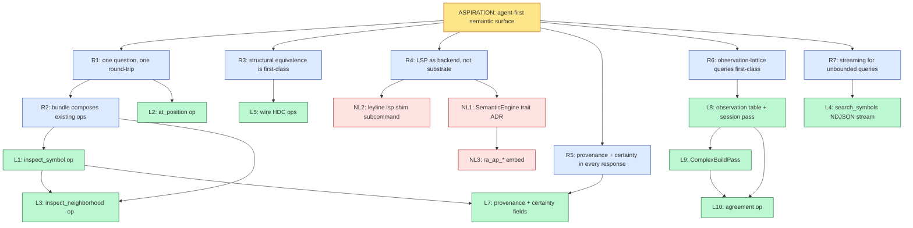

# Problem decomposition — `agent-first-semantic-surface`

> **Decomposed:** 2026-06-20 by `problem-decomposer`
> **Status:** Draft
> **Refresh after:** 2026-09-20

## Aspiration

Code intelligence in ley-line-open is exposed as a consistent, agent-first semantic surface. Agents query by symbol — not by cursor position — and receive bundled answers shaped uniformly across languages, carrying provenance and certainty in every response. Language-specific analyzer fidelity (rust-analyzer, gopls, pyright, tree-sitter, HDC structural signatures) is a backend implementation detail behind a single substrate-level abstraction; LSP becomes one such backend, not the substrate. Structural-equivalence and observation-lattice queries are first-class on the same surface, not bolted-on adjuncts.

## 5-Whys descent

### Chain 1 — `bundled-symbol-query`

```
[ASPIRATION] Consistent agent-first semantic surface in LLO
   ↑ why?
[REQUIREMENT] One agent question = one round-trip, not five
   ↑ why?
[REQUIREMENT] LSP forces 12 round-trips to answer "tell me about SocketClient.SendOp"; bundled responses fix the round-trip tax (ADR-0016 §2, Gate B)
   ↑ why?
[REQUIREMENT] The bundle shape (definition + hover_typed + references + callers + callees + freshness) must compose existing daemon ops into one response
   ↑ why?
[DISPATCHABLE] L1 — implement `inspect_symbol(symbol_id) -> Bundle` op in `daemon/ops.rs`
```

### Chain 2 — `symbol-keyed-translation`

```
[ASPIRATION] Consistent agent-first semantic surface in LLO
   ↑ why?
[REQUIREMENT] Agents have symbol names, not cursor positions; symbol-keyed lookup must be default (ADR-0016 §1)
   ↑ why?
[REQUIREMENT] Editor consumers still have positions; explicit translation hop keeps both audiences served
   ↑ why?
[DISPATCHABLE] L2 — implement `at_position(file, line, col) -> { symbol_id, kind }` op
```

### Chain 3 — `neighborhood-walk`

```
[ASPIRATION] Consistent agent-first semantic surface in LLO
   ↑ why?
[REQUIREMENT] Agents need N-hop call/ref graph in one request, not 1+N+N² round-trips (ADR-0016 §5)
   ↑ why?
[REQUIREMENT] Bounded by depth (≤4), byte cap (default 64KB), per-distance truncation
   ↑ why?
[DISPATCHABLE] L3 — implement `inspect_neighborhood(id, depth, edge_kinds, max_bytes)` op (depends on L1)
```

### Chain 4 — `streaming-search`

```
[ASPIRATION] Consistent agent-first semantic surface in LLO
   ↑ why?
[REQUIREMENT] Unbounded queries (10K-result symbol search) need first-result-fast, not all-results-buffered (ADR-0016 §6)
   ↑ why?
[REQUIREMENT] NDJSON streaming over MCP `tools/call` response body; cancel-on-close
   ↑ why?
[DISPATCHABLE] L4 — implement `search_symbols(pattern, limit, kind?)` as NDJSON stream
```

### Chain 5 — `structural-equivalence-as-query`

```
[ASPIRATION] Consistent agent-first semantic surface in LLO
   ↑ why?
[REQUIREMENT] Agents need "are these two pieces of code semantically equivalent?" as a first-class query, not a workflow they have to construct
   ↑ why?
[REQUIREMENT] HDC (leyline-hdc) was built for exactly this (Deckard-style canonical-kind signatures + popcount distance) but has zero production callers; the bridge `daemon/hdc_pass.rs` exists but no daemon op exposes it
   ↑ why?
[DISPATCHABLE] L5 — wire HDC daemon ops: `hdc_search`, `hdc_calibrate`, `hdc_density` (composes existing `leyline-hdc` API surface)
```

### Chain 6 — `lsp-as-backend-not-substrate`

```
[ASPIRATION] Consistent agent-first semantic surface in LLO
   ↑ why?
[REQUIREMENT] LSP servers are language-specific analyzers; their data should reach agents through the substrate's uniform shape, not as LSP-shaped wire artifacts
   ↑ why?
[REQUIREMENT] Editor consumers still want LSP; thin shim subcommand bridges native ops outward (ADR-0016 §8) — coverage map already defines every method's translation status
   ↑ why?
[DISPATCHABLE] L6 — implement `leyline lsp` subcommand: JSON-RPC LSP server speaking the 12 supported-via-translation methods on top of native ops (depends on L1, L2)
```

### Chain 7 — `provenance-and-certainty-fields`

```
[ASPIRATION] Consistent agent-first semantic surface in LLO
   ↑ why?
[REQUIREMENT] Agents must distinguish "ra_ap_ide returned this at full fidelity" from "tree-sitter heuristic, low confidence"; today no LLO response carries that signal
   ↑ why?
[REQUIREMENT] Add `provenance` (which analyzer answered) + `certainty` (full / partial / heuristic) fields to bundle responses uniformly — extends ADR-0016 §2 with information current ADR does not specify
   ↑ why?
[DISPATCHABLE] L7 — extend response schema with `provenance` + `certainty` enum; wire all current op paths to populate them; gate via schema-validation test
```

### Chain 8 — `observation-lattice-queries`

```
[ASPIRATION] Consistent agent-first semantic surface in LLO
   ↑ why?
[REQUIREMENT] Cross-source agreement and co-change are first-class agent questions ("is this symbol stable across observers?", "what changed alongside this?") — ADR-0020 specifies them
   ↑ why?
[REQUIREMENT] ADR-0020 falsifiability gates 1–4 are unshipped; the `observation` table + `ComplexBuildPass` + three ops (`neighborhood`, `agreement`, `co_changed_with`) must land for the surface to include lattice queries
   ↑ why?
[DISPATCHABLE] L8 — implement `observation` table + one observation-emitting enrichment pass (Gate 1)
[DISPATCHABLE] L9 — implement `ComplexBuildPass` that calls `CellComplex` + `CoChangeTracker::observe` (Gate 2)
[DISPATCHABLE] L10 — implement `agreement(token, payload_kind)` op via `detect_violations` (Gate 3)
```

## Requirement lattice

| ID | Requirement | Parent(s) | Child(ren) |
|----|-------------|-----------|------------|
| R1 | One agent question = one round-trip | Aspiration | R2, L2 |
| R2 | Bundle shape composes existing ops | R1 | L1, L3 |
| R3 | Structural equivalence is first-class | Aspiration | L5 |
| R4 | LSP demoted from substrate to backend | Aspiration | L6, NL1 |
| R5 | Responses carry provenance + certainty | Aspiration | L7, NL1 |
| R6 | Observation-lattice queries are first-class | Aspiration | L8, L9, L10 |
| R7 | Streaming for unbounded queries | Aspiration | L4 |

## Dispatchable leaves

### L1 — `Implement inspect_symbol(symbol_id) -> Bundle daemon op`

- **Aspiration root:** Consistent agent-first semantic surface
- **Why chain:** L1 → R2 → R1 → Aspiration
- **Problem statement:** ADR-0016 §2 specifies `inspect_symbol(symbol_id) -> Bundle` that returns `{ symbol_id, kind, definition, hover_typed, references, implementations, callers, callees, freshness }` in one response. The op composes existing `find_callers` / `find_callees` / `find_defs` / LSP hover / `get_node` primitives in `rs/ll-open/cli-lib/src/daemon/ops.rs`. Register in `daemon/mcp.rs` tool registry; add a `BaseRequest::InspectSymbol` variant. Optional `include` flag for opt-out of expensive sub-fields per ADR-0016 §2(b).
- **Acceptance criteria:**
  - `BaseRequest::InspectSymbol` variant exists; dispatch arm in `dispatch_typed`; entry in `base_op_names()` / `is_known_base_op()` / `tool_registry`
  - Drift tests `handle_base_op_dispatches_every_canonical_name` + `mcp::tool_registry ⊆ base_op_names()` pass
  - Round-trip test: query against the mache `_ast`/`_lsp` fixture; assert response matches ADR-0016 §2 JSON shape
  - Gate B p99 bench: full bundle for a typical Go function (9-caller order) returns in < 50ms on warm snapshot, ≤ 16KB JSON
- **Inputs:**
  - `rs/ll-open/cli-lib/src/daemon/ops.rs` (current dispatch)
  - `rs/ll-open/cli-lib/src/daemon/mcp.rs` (tool registry)
  - `rs/ll-open/cli-lib/src/daemon/wire.rs` (BaseRequest enum)
  - `docs/adr/0016-ai-native-query-surface.md` §2 (response shape)
- **Expected output shape:** PR against `main`; touches `ops.rs`, `mcp.rs`, `wire.rs`, adds test in `cli-lib/tests/`; net diff 300–500 LOC
- **Scope boundary:** Just `inspect_symbol`. NOT `inspect_neighborhood` (L3). NOT `at_position` (L2). NOT LSP shim (L6).
- **Failure mode:** drift test fails, or bench test exceeds 50ms p99, or response shape mismatches ADR-0016 §2 fixture
- **Time-box estimate:** M (composes existing ops; new bundle shape + 4 drift tests)
- **Suggested target repo:** ley-line-open
- **Suggested priority:** P1
- **Depends on:** none

### L2 — `Implement at_position(file, line, col) -> { symbol_id, kind } daemon op`

- **Aspiration root:** Consistent agent-first semantic surface
- **Why chain:** L2 → R1 → Aspiration
- **Problem statement:** ADR-0016 §1 establishes symbol-keyed lookup as the default; `at_position` is the explicit translation hop editors use to bridge cursor → symbol_id. Walks `_ast` table for a node spanning `(line, col)`, returns the canonical symbol_id format.
- **Acceptance criteria:**
  - `BaseRequest::AtPosition` variant + dispatch arm + registry entries
  - Drift tests pass
  - Fixture test: known positions in a Go file resolve to expected symbol_ids; positions outside any node return `null`
  - Round-trip test: `at_position(file, line, col)` → `inspect_symbol(returned_id)` returns a bundle whose `definition.line_start ≤ line ≤ line_end`
- **Inputs:**
  - `rs/ll-open/cli-lib/src/daemon/ops.rs`, `mcp.rs`, `wire.rs`
  - `docs/adr/0016-ai-native-query-surface.md` §1
  - `_ast` table layout in `rs/ll-open/cli-lib/src/cmd_parse.rs` (col/line columns)
- **Expected output shape:** PR; ~150 LOC including tests
- **Scope boundary:** Just `at_position`. NOT symbol_id format standardization (open ADR-0016 implementation question).
- **Failure mode:** drift test fails or fixture mismatch
- **Time-box estimate:** S
- **Suggested target repo:** ley-line-open
- **Suggested priority:** P1
- **Depends on:** none

### L3 — `Implement inspect_neighborhood(id, depth, edge_kinds, max_bytes) daemon op`

- **Aspiration root:** Consistent agent-first semantic surface
- **Why chain:** L3 → R2 → R1 → Aspiration
- **Problem statement:** ADR-0016 §5. Returns focal symbol's bundle plus the N-hop neighborhood. Bounded by `depth` (default 1, max 4), `max_bytes` (default 64KB, max 1MB), per-distance truncation (distant neighbors get `symbol_id` + `hover_typed.signature` only).
- **Acceptance criteria:**
  - Variant + dispatch arm + registry entries; drift tests pass
  - Fixture test: depth-2 query on a known graph returns expected neighbor count + correct truncation at hop-2
  - Wire-counter assertion: `writes_for_neighborhood_query == 1` (ADR-0016 §5 falsifiability)
  - Byte-cap test: max_bytes=4096 returns truncated response with `truncated: true`
- **Inputs:** Same as L1 + `_lsp_refs`/`_lsp_defs` for edge expansion
- **Expected output shape:** PR; ~400 LOC (graph walk + truncation)
- **Scope boundary:** Bounded single-response shape only. Bidirectional streaming (ADR-0016 §5 alternative c) is out-of-scope.
- **Failure mode:** drift test fails, or wire-counter > 1, or byte-cap not enforced
- **Time-box estimate:** M
- **Suggested target repo:** ley-line-open
- **Suggested priority:** P2
- **Depends on:** L1

### L4 — `Implement search_symbols(pattern, limit, kind?) as NDJSON streaming op`

- **Aspiration root:** Consistent agent-first semantic surface
- **Why chain:** L4 → R7 → Aspiration
- **Problem statement:** ADR-0016 §6. Streams results as newline-delimited JSON over MCP `tools/call` response body and over UDS. First result emitted as soon as SQL `LIMIT` yields first row. Server detects closed socket and aborts.
- **Acceptance criteria:**
  - Variant + dispatch arm + registry entries; drift tests pass
  - 10K-result search returns first 100 results within 100ms even when total takes 5s (ADR-0016 §6 falsifiability — instrument `time_to_first_result_ms` and `time_to_completion_ms` separately)
  - Cancel test: closing the read side mid-stream aborts the query (verified via server-side log + query-not-finished assertion)
- **Inputs:** `daemon/ops.rs`, `mcp.rs`, `wire.rs`; SQLite streaming cursor docs; rusqlite `Statement::query` (not `query_map`)
- **Expected output shape:** PR; ~250 LOC (streaming cursor + NDJSON framer + cancel handler)
- **Scope boundary:** Just `search_symbols`. Pagination via cursor (ADR-0016 §6 alternative b) is a future bead if a consumer needs resume-after-disconnect.
- **Failure mode:** first-result latency > 100ms, or close-cancel doesn't abort
- **Time-box estimate:** M
- **Suggested target repo:** ley-line-open
- **Suggested priority:** P2
- **Depends on:** none

### L5 — `Wire HDC daemon ops: hdc_search / hdc_calibrate / hdc_density`

- **Aspiration root:** Consistent agent-first semantic surface
- **Why chain:** L5 → R3 → Aspiration
- **Problem statement:** `rs/ll-open/cli-lib/src/daemon/hdc_pass.rs` ships the tree-sitter → `EncoderNode` bridge. `leyline-hdc` ships full encoder + codebook + SQL UDFs + `query::{density_count, radius_search, explain_cluster_centroid}` + `calibrate::{calibrate_and_persist, load_baseline}`. **Zero production callers.** Wire three daemon ops: `hdc_search(query_code, lang, max_distance, k)` (radius_search), `hdc_calibrate(corpus_path, lang)` (calibrate_and_persist), `hdc_density(token)` (density_count). Remove the lying comment at `hdc_pass.rs:9` ("Feature-gated behind `hdc`" — no such feature exists in any Cargo.toml).
- **Acceptance criteria:**
  - 3 ops registered: variant + dispatch arm + base_op_names + tool_registry; drift tests pass
  - Fixture test: encode 5 small Go functions; assert `hdc_search` returns expected k-NN ordering; assert `hdc_density` returns the right population count
  - `hdc_pass.rs:9` comment removed/corrected
  - Background: HDC schema tables (`hdc_*`) created on demand via `leyline_hdc::schema::create_hdc_schema` when `hdc_calibrate` first runs; idempotent
- **Inputs:**
  - `rs/ll-open/hdc/src/lib.rs` (encoder + codebook surface)
  - `rs/ll-open/hdc/src/query.rs` (radius_search, density_count, explain_cluster_centroid)
  - `rs/ll-open/hdc/src/calibrate.rs` (calibrate_and_persist, load_baseline)
  - `rs/ll-open/hdc/src/schema.rs` (create_hdc_schema)
  - `rs/ll-open/hdc/src/sql_udf.rs` (register_hdc_udfs)
  - `rs/ll-open/cli-lib/src/daemon/hdc_pass.rs` (tree → EncoderNode bridge)
  - `rs/ll-open/cli-lib/src/daemon/ops.rs`, `mcp.rs`, `wire.rs`
- **Expected output shape:** PR; ~400 LOC across 3 op handlers + 3 MCP registrations + tests
- **Scope boundary:** Just the daemon-op wiring. NOT integrating HDC into `inspect_symbol`'s bundle (separate bead once shape is known). NOT HDC over the LSP shim.
- **Failure mode:** drift test fails, k-NN ordering mismatch on fixture, or `register_hdc_udfs` not invoked → SQL UDFs unresolved at query time
- **Time-box estimate:** M
- **Suggested target repo:** ley-line-open
- **Suggested priority:** P1 (HDC has been built-but-unwired for the substrate's entire life; this is the highest-impact "incomplete feature" item)
- **Depends on:** none

### L7 — `Add provenance + certainty fields to bundle responses`

- **Aspiration root:** Consistent agent-first semantic surface
- **Why chain:** L7 → R5 → Aspiration
- **Problem statement:** ADR-0016 §2's bundle shape does not include provenance (which analyzer answered) or certainty (full / partial / heuristic / tree-sitter-only). Extend the response schema with two new fields applied uniformly across `inspect_symbol`, `inspect_neighborhood`, `lsp_hover`, `lsp_defs`, `lsp_refs`. Backend annotates each sub-result with its provenance; certainty is the analyzer's self-reported confidence (LSP backends return `full`; tree-sitter-only fallback returns `heuristic`).
- **Acceptance criteria:**
  - `Provenance` enum: `{ RustAnalyzer, Gopls, Pyright, Tsserver, Clangd, JDTLS, ZLS, TreeSitter, HDC, Combined }`
  - `Certainty` enum: `{ Full, Partial, Heuristic, Cached }`
  - Every bundle response carries `provenance` + `certainty` at the top level AND inside each sub-array (e.g. `callers[].provenance`)
  - Schema-validation test gates the field's presence in CI
  - Round-trip fixture: query against the mache repo via gopls-backed LSP path; assert `provenance == Gopls` + `certainty == Full`
  - tree-sitter-only fallback path: assert `provenance == TreeSitter` + `certainty == Heuristic`
- **Inputs:**
  - `docs/adr/0016-ai-native-query-surface.md` §2
  - `rs/ll-open/cli-lib/src/daemon/ops.rs` (all bundle-producing paths)
  - `rs/ll-open/lsp/src/languages.rs` (server-id → Provenance mapping)
- **Expected output shape:** PR; ~300 LOC (enum + threading + schema-validation test)
- **Scope boundary:** Field additions only. Per-language ranking model (which provenance "wins" when two answer) is a future bead.
- **Failure mode:** schema-validation test fails (field missing on any path)
- **Time-box estimate:** M
- **Suggested target repo:** ley-line-open
- **Suggested priority:** P1 (extends ADR-0016 §2 with the user-named missing piece — provenance is what makes the surface "agent-first" beyond what ADR-0016 currently commits to)
- **Depends on:** L1 (need a bundle shape to extend)

### L8 — `Implement observation table + one observation-emitting enrichment pass`

- **Aspiration root:** Consistent agent-first semantic surface
- **Why chain:** L8 → R6 → Aspiration
- **Problem statement:** ADR-0020 falsifiability Gate 1. Create the `observation` table per §1 schema. Implement one enrichment pass that walks Claude Code session JSONLs (the `agent-corpus` crate already provides the parser) and emits rows with `payload_kind = "agent.session_turn"` and `mentions` populated with cited paths/symbols/beads.
- **Acceptance criteria:**
  - Schema migration creates `observation` table + indexes
  - `EnrichmentPass` impl `SessionObservationPass` registered in `enrichment.rs`
  - Fixture test: ingest a 5-turn fixture session; assert row count = 5; assert `mentions` arrays contain cited paths verified against fixture
  - Inline-vs-hash threshold (4096 bytes) honored: small payloads in `payload_inline`, large in `BlobStore` + `payload_hash`
- **Inputs:**
  - `docs/adr/0020-entity-observation-lattice.md` §1
  - `rs/ll-open/cli-lib/src/daemon/enrichment.rs` (EnrichmentPass trait)
  - `rs/ll-open/agent-corpus/src/sources/claude_code.rs` (parser)
  - `leyline-core::BlobStore` for hash-backed large payloads
- **Expected output shape:** PR; ~400 LOC
- **Scope boundary:** Just the table + one pass. Other observation sources (git, rosary) are follow-up beads.
- **Failure mode:** fixture test row-count or mentions mismatch
- **Time-box estimate:** M
- **Suggested target repo:** ley-line-open
- **Suggested priority:** P2
- **Depends on:** none

### L9 — `Implement ComplexBuildPass calling CellComplex + CoChangeTracker`

- **Aspiration root:** Consistent agent-first semantic surface
- **Why chain:** L9 → R6 → Aspiration
- **Problem statement:** ADR-0020 falsifiability Gate 2. New enrichment pass that scans recent `observation` rows, builds a `leyline_sheaf::CellComplex` from unique mention tokens + co-occurrence edges, and hands it to `CoChangeTracker::observe`. Test asserts the code path mechanically invokes `leyline-sheaf::CellComplex` (the gate exists specifically to prove the math is load-bearing, not decorative).
- **Acceptance criteria:**
  - `ComplexBuildPass` registered in `enrichment.rs`
  - Fixture: 5–10 observation rows referencing 3–4 distinct tokens
  - Test asserts: complex constructed with expected node + edge count; `CoChangeTracker::observe` was called (verified via spy or invocation counter); internal edge weights updated
  - Test FAILS if the code path doesn't actually call into `leyline-sheaf::CellComplex` (the gate must be a real assertion, not "this typechecks")
- **Inputs:**
  - `docs/adr/0020-entity-observation-lattice.md` §2
  - `rs/ll-open/sheaf/src/cell_complex.rs`, `co_change_tracker.rs`
  - `rs/ll-open/cli-lib/src/daemon/enrichment.rs`
- **Expected output shape:** PR; ~350 LOC
- **Scope boundary:** Just pass construction + invocation. Three query ops (`neighborhood` / `agreement` / `co_changed_with`) are separate beads.
- **Failure mode:** Spy/counter assertion fails
- **Time-box estimate:** M
- **Suggested target repo:** ley-line-open
- **Suggested priority:** P2
- **Depends on:** L8

### L10 — `Implement agreement(token, payload_kind) op via detect_violations`

- **Aspiration root:** Consistent agent-first semantic surface
- **Why chain:** L10 → R6 → Aspiration
- **Problem statement:** ADR-0020 falsifiability Gate 3. Implement the `agreement` daemon op per ADR-0020 §3. Computes `coherence_defect` via `CellComplex::detect_violations` against a degenerate 2-node complex (one node per source, identity restriction maps).
- **Acceptance criteria:**
  - Variant + dispatch arm + registry entries; drift tests pass
  - Fixture test: insert two `code.symbol_def` observations on the same token from different sources with disagreeing fields
  - Assert: response `defects` array is non-empty; assert computation path went through `CellComplex::detect_violations` (verified via spy)
- **Inputs:**
  - `docs/adr/0020-entity-observation-lattice.md` §3
  - `rs/ll-open/sheaf/src/cell_complex.rs::detect_violations`
  - `rs/ll-open/cli-lib/src/daemon/{ops.rs, mcp.rs, wire.rs}`
- **Expected output shape:** PR; ~300 LOC
- **Scope boundary:** Just `agreement`. `neighborhood` + `co_changed_with` are separate beads.
- **Failure mode:** Spy fails (path doesn't reach `detect_violations`) or defects array doesn't reflect injected disagreement
- **Time-box estimate:** M
- **Suggested target repo:** ley-line-open
- **Suggested priority:** P2
- **Depends on:** L8, L9

## Non-leaves queue

| Title | Fails property | What would unblock |
|-------|----------------|---------------------|
| **NL1 — Design semantic-surface ADR: arena as the layer with req/resp removed; backends populate it; query is mmap-direct** | #2 (no acceptance criteria — output shape is a decision, not a diff), #4 (output shape undefined until designed) | Write a new ADR (0023? 0024?) that commits to the user's framing (2026-06-20): **the arena IS the agent-first surface; request/response is one access path, not the canonical one.** The Σ Merkle-CAS substrate already gives content-addressed structured data with generation-counter freshness (ADR-0016 §7); agents that mmap the arena read directly with zero RTT, zero JSON, zero round-trip tax. The `SemanticEngine` shape inverts: backends (ra_ap_ide / gopls / pyright / tree-sitter / HDC) are *populators* of canonical arena rows, not implementors of a query trait. The query surface (`inspect_symbol`, etc.) becomes a remoting adapter over MCP/UDS for consumers that can't mmap (cloister, remote agents) — the local fast-path is direct arena read. Without this ADR, L1–L7 ship as direct daemon ops over MCP; the language-uniformity goal is met procedurally but the arena-direct architecture is unstated and gets reinvented every consumer cycle. |
| **NL2 — Implement `leyline lsp` JSON-RPC shim subcommand (full ADR-0016 §8 coverage map)** | #5 (unbounded scope: 12 supported methods, 6 hot, 6 cold, 8 intentionally-unsupported = 20+ branches; ADR estimates ~2000 LOC), #7 (time-box too large for one session) | Decompose into per-method-group beads: (a) shim binary + JSON-RPC framing, (b) `hover`/`definition`/`references` over `inspect_symbol`, (c) `documentSymbol`/`diagnostics` over existing `lsp_symbols`/`lsp_diagnostics`, (d) lifecycle methods (`initialize`/`didOpen`/`didChange`/`didSave`/`didClose`) as local-cache shim, (e) `workspace/symbol` + `callHierarchy` over `search_symbols`/`inspect_neighborhood`. Once decomposed, each sub-bead passes property #5 and #7. |
| **NL3 — Embed `ra_ap_*` libraries directly as a native Rust SemanticEngine backend** | #1 (problem statement requires the SemanticEngine trait to exist first — NL1), #3 (inputs depend on which `ra_ap_*` crate versions are stable + matching ley-line's `rustc` toolchain) | Resolve NL1 first. Then file as a leaf: target crates (`ra_ap_ide`, `ra_ap_syntax`, `ra_ap_hir`), pin versions, define which trait methods the impl covers, performance vs subprocess gopls/etc baseline. |
| **NL4 — LSP server-presence probe + `lsp_status` op** | (Dispatchable, but lower priority and orthogonal to the core aspiration; queueing here to surface but not file as a primary leaf) | Could be filed as a P3 leaf — small, ~100 LOC, runs `Command::new(srv.0).arg("--version")` on startup, reports per-language readiness via new `lsp_status` op. Mentioned in the LSP "wack" assessment but not load-bearing for the agent-first aspiration. |
| **NL5 — End-to-end LSP integration test (real gopls in CI)** | #3 (inputs include "gopls available on CI runner" — needs CI infra decision) | File as a leaf once the CI policy on language-server availability is decided. Could be self-contained-via-container or runner-availability-via-action. |
| **NL6 — `co_changed_with(token, window_ms)` op (ADR-0020 §3)** | (Dispatchable; same shape as L10 but distinct op) | Will become L11 once L8, L9 land. Not yet filed because its acceptance criteria depend on Gate 4 (property test for typed-payload registry) which is its own thread. |
| **NL7 — `neighborhood(token, k)` op (ADR-0020 §3)** | (Dispatchable; same shape as L10) | Will become L12 once L8, L9 land. Same gating as NL6. |

## Lattice (Mermaid)



## Action items

- [x] **Filed 2026-06-20** as P1 beads:
  - L1 → `ley-line-open-c2c4d9` (inspect_symbol)
  - L2 → `ley-line-open-c2e602` (at_position)
  - L5 → `ley-line-open-c32596` (HDC wiring)
  - L7 → `ley-line-open-c3555f` (provenance + certainty; depends_on c2c4d9)
- [x] **Filed 2026-06-20** as P2 beads:
  - L3 → `ley-line-open-c77690` (inspect_neighborhood; depends_on c2c4d9)
  - L4 → `ley-line-open-c79953` (search_symbols NDJSON)
  - L8 → `ley-line-open-c7c79a` (observation table + session pass)
  - L9 → `ley-line-open-c7eae2` (ComplexBuildPass; depends_on c7c79a)
  - L10 → `ley-line-open-c8090f` (agreement op; depends_on c7c79a + c7eae2)
- [ ] Track NL1 separately — write the SemanticEngine trait ADR before NL2 / NL3 become dispatchable; **this is the largest hidden gap** because ADR-0016 doesn't commit to backends-as-plug-ins
- [ ] Track NL2 — decompose `leyline lsp` shim into 5 per-method-group sub-beads when ready
- [ ] After L1 + L7 ship: refresh this doc; bundle-response shape is the spine and field additions surface second-order requirements
- [ ] After L5 ships: consider whether HDC outputs belong in `inspect_symbol`'s bundle (`hover_typed.structural_signature: HdcVector`) — would extend ADR-0016 §2 again

## Cross-references

- Skill that produced this: `~/.claude/skills/problem-decomposer/`
- Dispatchability rubric: [`../../../../../.claude/skills/problem-decomposer/DISPATCHABILITY.md`](../../../../../.claude/skills/problem-decomposer/DISPATCHABILITY.md)
- Related ADRs:
  - `docs/adr/0016-ai-native-query-surface.md` — the spine; L1–L4, L7, NL2 derive from it
  - `docs/adr/0020-entity-observation-lattice.md` — observation-lattice branch; L8–L10 derive from it
  - `docs/adr/0014-capnp-as-protocol.md` — wire encoding (not revisited)
  - `docs/adr/0015-lazy-on-access-ingestion.md` — ingestion lifecycle (not revisited)
- Related beads (all closed):
  - `ley-line-open-9f491f` — ADR-0016 tracking
  - `ley-line-open-8bf731` — ADR-0020 tracking
  - `ley-line-open-79a37c` — agent-corpus crate (shipped; consumer for L8)
- Code surface (verified to exist 2026-06-20):
  - `rs/ll-open/cli-lib/src/daemon/ops.rs` — 32 op handlers; L1–L4, L5, L10 add to dispatch
  - `rs/ll-open/cli-lib/src/daemon/mcp.rs` — tool registry; all leaves register here
  - `rs/ll-open/cli-lib/src/daemon/hdc_pass.rs` — HDC bridge exists, zero production callers (L5 fixes)
  - `rs/ll-open/hdc/` — leyline-hdc crate full surface, never invoked from production
  - `rs/ll-open/lsp/src/languages.rs` — 11 languages, 7 server bundles
  - `rs/ll-open/sheaf/` — CellComplex + CoChangeTracker (L9, L10 consume)
