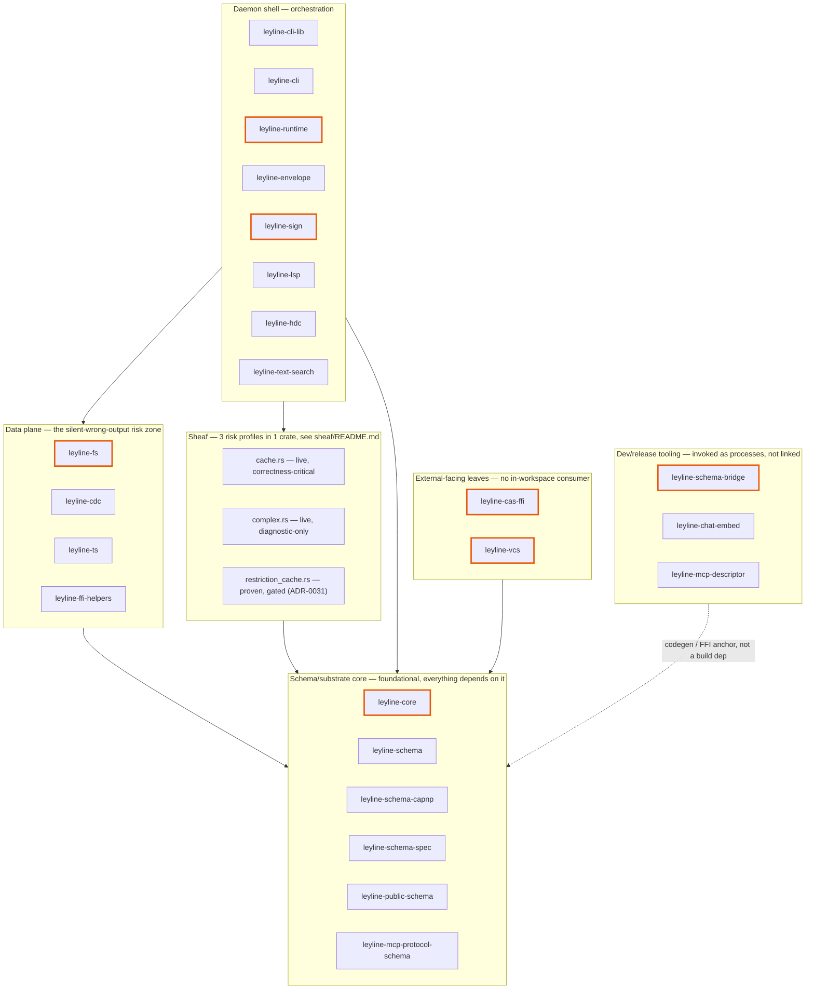

# Rust workspace — `rs/`

The Rust workspace for ley-line-open. Two tiers: `ll-core/` (infrastructure) and `ll-open/` (projection engine). Top-level [README](../README.md) covers project framing; this file is the orientation map for the workspace.

## Tier 1: Infrastructure (`ll-core/`)

| Crate | Purpose |
|---|---|
| [`leyline-core`](ll-core/core/) | Arena header + Controller (mmap'd control block, `current_root: [u8; 32]`); `ContentAddressed` trait (σ substrate entry point, BLAKE3-locked) |
| [`leyline-schema`](ll-core/schema/) | Shared SQLite `nodes` table DDL — local SQL projection contract |
| [`leyline-public-schema`](ll-core/public-schema/) | Cap'n Proto schema for the daemon UDS + MCP wire (`daemon.capnp`) |
| [`leyline-schema-capnp`](ll-core/schema-capnp/) | Cap'n Proto schemas for the Σ event log (AstNode, SourceFile, BindingRecord, Head, AstNodeList) |
| [`leyline-schema-spec`](ll-core/schema-spec/) | Vendor-neutral capability specs (`credential-isolation/v1`, `confinement/v1`, `build-cache/v1`, `mcp-tool/v1`); ships canonical test vectors + SHA-256 integrity pins + BLAKE3-256 identity pins verified by cargo tests |
| [`leyline-ffi-helpers`](ll-core/ffi-helpers/) | Typed helpers (`c_input`, `c_output`, `c_cstr`, `c_ref`) for the C-boundary raw-pointer pattern every LLO `extern "C" fn` uses |
| [`leyline-mcp-descriptor`](ll-core/mcp-descriptor/) | MCP Registry `server.json` emitter — shared coverage-validation + render, used by `server-json-gen` |
| [`leyline-mcp-protocol-schema`](ll-core/mcp-protocol-schema/) | MCP JSON-RPC method-name facts generated at build time from a digest-pinned schema; a digest mismatch fails compilation |

## Tier 2: Projection engine (`ll-open/`)

| Crate | Purpose |
|---|---|
| [`leyline-fs`](ll-open/fs/) | SqliteGraph (zero-copy `sqlite3_deserialize`), Graph trait, reader pool, NFS/FUSE mount |
| [`leyline-ts`](ll-open/ts/) | Tree-sitter AST projection + bidirectional splice; κ CFG-kind vocabulary + CFG builder (T1.b3, [`analysis-substrate`](../docs/decades/analysis-substrate.md) decade) |
| [`leyline-lsp`](ll-open/lsp/) | LSP client — spawns language servers, projects symbols + diagnostics; emits `BindingRecord` capnp event log |
| [`leyline-hdc`](ll-open/hdc/) | Hyperdimensional computing — per-scope hypervectors for structural code search |
| [`leyline-sheaf`](ll-open/sheaf/) | Čech cohomology engine — sheaf cache + coboundary operators + structural invalidation. **Not one risk profile** — see [`sheaf/README.md`](ll-open/sheaf/README.md) for the 3-way live/diagnostic/gated split |
| [`leyline-cdc`](ll-open/cdc/) | Content-defined chunking (GearHash, xet-compatible params) over the Σ substrate — chunk-level dedup for the mount storage path |
| [`leyline-envelope`](ll-open/envelope/) | DSSE envelope + in-toto Statement v1 attestation over `leyline-sign`'s root signer |
| [`leyline-runtime`](ll-open/runtime/) | Capability-resolved execution lifecycle + isolation backends (`execution/v1`) — authorization, backends (native/libkrun), confinement (ADR-0035) |
| [`leyline-vcs`](ll-open/vcs/) | jj sidecar — automatic versioning of arena snapshots. **External-facing**: no in-workspace consumer, git-rev pinned directly by rosary |
| [`leyline-sign`](ll-open/sign/) | Σ `Head` root signer/verifier (`Ed25519RootSigner`, `verify_head`, canonical `kid`; S1/S2/S3) + CMS signing primitives + gpgsm-compatible binary for jj commit signing (host feature ships `leyline-sign-helper` daemon per ADR-0019) |
| [`leyline-cas-ffi`](ll-open/cas-ffi/) | Wasm32-callable FFI for BLAKE3-substrate hash. **External-facing**: no in-workspace consumer, consumed by cloister via workerd's cdylib loader |
| [`leyline-schema-bridge`](ll-open/schema-bridge/) | capnp compiler plugin family — capnp schemas → zod TS / Go / JSON Schema codegen; unmapped constructs are hard errors. Build-time tool, also a rosary build-anchor |
| [`leyline-text-search`](ll-open/text-search/) | Unstructured-text semantic search backend abstraction. `NullEngine` default; `WitchcraftEngine` (XTR-WARP) behind feature flag |
| [`leyline-chat-embed`](ll-open/chat-embed/) | CLI binary: semantic search over Claude Code chat databases via fastembed/MiniLM |
| [`leyline-cli-lib`](ll-open/cli-lib/) | Daemon: living SQLite db + arena flip + Σ root advance + MCP/UDS surfaces; hosts every enrichment pass |
| [`leyline-cli`](ll-open/cli/) | `leyline` binary — `parse`, `lsp`, `daemon`, `serve`, `inspect` subcommands |

## Crate dependency graph

Logical units, not a literal per-crate graph (24 crates is too dense to read at that resolution) — grouped by shared release/test stance, per the `[[repo]]` external-consumer audit below. Crates outlined in orange are **git-rev/tag pinned directly by another repo's `Cargo.toml`** — bumping them isn't free for LLO's internal cadence alone, regardless of how rarely they change internally.



## Tier-isolation gate

`ll-core/*` crates MUST compile without `ll-open/*`. CI gate: `task tier:isolation` builds `leyline-core`, `leyline-schema`, `leyline-public-schema`, `leyline-schema-capnp` in isolation. If a `ll-core/*` Cargo.toml gains a `ll-open/*` path dep, the gate fails.

## Build

```bash
# From the workspace root (rs/):
cargo build --workspace
cargo test --workspace

# Or via the Taskfile from the repo root (preferred — wires pkg-config for macFUSE-T on macOS):
cd .. && task ci             # check + clippy + fmt + FFI staticlib + tier isolation + test
cd .. && task install:full   # release + codesign + install to ~/.local/bin — recommended for consumers
# See ../README.md#install for the full three-path matrix (install / install:full / install:full+mount).
```

## Cap'n Proto toolchain

Exact-pinned per [ADR-0014 §3](../docs/adr/0014-capnp-as-protocol.md):

- `capnp = "=0.25.0"`
- `capnpc = "=0.25.0"`
- `capnp-json = "=0.1.0"` (daemon wire codec only)

System `capnp` binary required for `build.rs` codegen — `brew install capnp` (macOS) or `apt-get install capnproto libcapnp-dev` (Ubuntu). The `libcapnp-dev` package ships the standard schema includes (`/usr/include/capnp/c++.capnp` etc.) that `capnp-json`'s build script needs.
